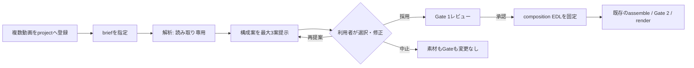

# 複数素材からの構成提案

> 状態: 初期リリース実装済み
> 対象: Tsugite の手持ち動画編集
> 本書は、複数の入力動画を横断して分析し、目的に合う編集構成案を提案する機能を定義する。動画生成機能の仕様ではない。

## 1. 目的

利用者が複数の動画を1つの project に入れ、完成したい動画の目的・視聴者・尺を伝えると、Tsugite が素材を横断して読み取り、**使う候補区間とその順番を持つ構成案**を複数提示する。

利用者は構成案を確認して、採用、修正、または破棄を選ぶ。解析・提案だけで元素材、manifest、Gate、最終動画は変更しない。採用された構成案だけが、既存の Gate 1 承認後の編集工程へ進む。

これは「自動で不要部分を切る」機能ではなく、**複数素材から編集のたたき台を作る機能**である。

## 2. 利用者ができること

### 入力

- project 内の manifest に、数秒から長尺までの複数動画を登録する。
- 完成動画について、次を指定する。
  - 目的（例: 活動紹介、イベント記録、商品紹介、ハイライト）
  - 視聴者
  - 希望尺（例: 30秒、2分、5分）
  - 構成の優先方針（時系列、見どころ優先、説明重視、雰囲気重視）
  - 必ず含めたい／除外したい素材または区間（任意）
- 解析方法を `local`、`hybrid`、`cloud` から明示的に選ぶ。既存の外部解析契約をそのまま適用する。

### 出力

- 素材一覧: 尺、解像度、音声の有無、解析状態、代表フレーム。
- 区間候補: 各候補の元動画、開始・終了時刻、内容の説明、技術上の注意、採用理由。
- 構成案: 目的・想定尺・狙い・採用区間・順番・各区間の役割を持つ、最大3案。
- レビュー画面: 元動画の時刻へ戻れるプレビュー、構成案ごとの尺、根拠、除外理由、注意事項。
- 承認後の `composition-edl.json`: 選ばれた区間の順番と元動画上の位置を固定した編集指示。

## 3. 利用例

利用者が20本の素材と「初めての人にも内容が伝わる2分の紹介動画。見どころ優先」を入力する。

Tsugite は、素材を場面単位に分け、同じ内容の繰り返しや技術品質の低い区間を候補から下げる。その後、次のような案を示す。

1. **見どころ先行**: 印象的な場面 → 全体像 → 主な体験 → 締め。
2. **時系列**: 導入 → 準備 → 本編 → 結果・余韻。
3. **説明重視**: 何をするか → 具体例 → 価値・結果 → 次の行動。

各案には「何番の動画の、何秒から何秒までを、なぜ使うか」が表示される。利用者が1案を選び、区間を追加・削除・並べ替えた後に Gate 1 で承認する。

## 4. 対象範囲

### 初期リリースに含める

- 複数のローカル動画を同じ manifest から横断解析する。
- 場面分割、代表フレーム、音声・文字起こし・無音などの既存解析結果を統合する。
- 視覚解析adapterが利用可能な場合、場面の内容・動き・画角・品質に関する**観察結果**を追加する。
- 利用者の brief と `story-guides` の助言から、順番の異なる構成案を最大3案作る。
- 区間の重複、希望尺、除外指定、素材の安全な参照を機械検査する。
- Gate 1 で1案を人が選んだ後だけ、選択案を編集用manifestへコンパイルする。
- Gate 2 / Gate 3 では、既存の成果物・最終動画QAを利用する。

### 初期リリースに含めない

- 利用者の確認なしに render、Gate 承認、外部送信、削除を行うこと。
- 人物の本人特定、属性推定、感情を事実として断定すること。
- 著作権、肖像権、出演許諾を自動判定すること。
- 外部BGM・ナレーション・SFXを含む既存タイムラインの自動再配置。
- 元動画を上書き・分割・削除すること。
- 「最良」の唯一解を断定すること。提案は常に比較可能な候補である。

## 5. 用語

| 用語 | 意味 |
| --- | --- |
| 素材 | manifest に登録された入力動画。元素材は不変。 |
| 区間 | 1つの素材の開始時刻・終了時刻で特定される利用候補。 |
| 観察 | adapter が返す、場面内容・音・技術品質などの根拠付き情報。推測を事実扱いしない。 |
| 構成案 | 目的と希望尺を満たすよう、区間を順序付きで並べた提案。 |
| composition EDL | 採用済み構成案を固定する編集指示。既存の削除中心 `editorial EDL` とは別の成果物。 |
| brief | 利用者が指定する目的、視聴者、尺、優先方針、必須・除外条件。 |

## 6. ユーザー体験と状態遷移



1. `validate` は素材が project 内に存在し、安全な相対pathであることを確認する。
2. `analyze` は素材を変更せず、解析成果物のみを `dist/<run-id>/analysis/` に書く。
3. `compose`（新設）または `analyze --compose` は、解析済み成果物と brief から構成案を作る。Gate は変更しない。
4. `review` は構成案と根拠を表示する。利用者は採用する案と修正内容を明示する。
5. Gate 1 承認時だけ、採用済み構成案の digest を持つ composition EDL を編集用manifestへ反映する。
6. 既存どおり、Coordinator と明示承認がなければ `run` / `render` は実行しない。

## 7. 構成案を作るための分析

### 7.1 素材の正規化

各素材について、少なくとも次を得る。

- SHA-256、尺、fps、解像度、映像・音声streamの有無。
- 時間軸上の場面境界と代表フレーム。
- 無音、黒画面、破損、極端な露出・音量などの技術的注意。
- 利用可能な場合は文字起こし、章、既存のカット候補。

素材ごとに異なるfps・解像度・縦横比が混在することは許容する。最終出力仕様との適合は、既存backendの検証に委譲する。

### 7.2 視覚・音声の観察

視覚解析は vendor-neutral な analysis adapter として実装する。adapter は各区間について次のような観察を返せる。

- 場面・行動・物体・テキストなど、短い説明。
- 画角、カメラの静止／移動、被写体の動き、視線・進行方向など、連続性を検討する材料。
- 明るさ、手ブレ、ピント、音声明瞭度などの品質シグナル。
- 同一または類似した場面のクラスタ。
- 根拠となる代表フレームまたは時刻範囲、信頼度、adapter名。

観察は「構成の判断材料」であり、採否や真偽の自動決定ではない。低信頼の観察は、提案根拠から除外するか、明示的な要確認として表示する。

### 7.3 構成の提案

構成提案器は、素材の順番を前提にせず、brief・観察・文字起こし・品質シグナルを使って区間を選ぶ。

提案前に `story-guides` を実行し、目的と希望尺に合う第一候補・補助候補・不採用の構成法・映像文法を記録する。構成法は助言であり、素材への強制や自動実行を意味しない。

提案器は少なくとも次を守る。

- 希望尺の範囲に収める。満たせない場合は不足・超過理由を表示する。
- 同一またはほぼ同一の区間を重複採用しない。
- brief の必須・除外指定を優先する。
- 各区間に「導入」「状況説明」「具体例」「転換」「締め」などの役割を付ける。
- 前後の動き、画角、音、話題の急な断絶を警告する。警告は自動不採用の理由にはしない。
- 少なくとも2案を作れる場合は、採用基準が異なる案にする。

## 8. データ契約

既存の `analysis` 契約を拡張し、少なくとも次の出力型を追加する。

```text
scene_observations      区間ごとの観察・品質・根拠
similarity_groups       重複／類似素材のグループ
composition_proposals   順序付きの構成案
```

`composition-proposals.json` の概念形は次のとおりとする。

```json
{
  "schema_version": 1,
  "run_id": "example-run",
  "source_manifest_digest": "sha256...",
  "analysis_digest": "sha256...",
  "brief": {
    "goal": "活動を初めての人へ紹介する",
    "audience": "Webサイト訪問者",
    "target_duration_seconds": 120,
    "priority": "highlight"
  },
  "proposals": [{
    "id": "highlight-v1",
    "title": "見どころ先行",
    "rationale": "印象的な場面で始め、全体像と具体例を補う",
    "estimated_duration_seconds": 118,
    "story_guidance": { "primary": "digest", "supporting": ["case-study"] },
    "segments": [{
      "source_clip_id": "clip-03",
      "source_start": 12.4,
      "source_end": 19.8,
      "role": "hook",
      "reason": "動きと主題が明確",
      "observation_ids": ["obs-031"]
    }],
    "warnings": []
  }]
}
```

すべての区間は `source_clip_id` と元動画上の時刻で参照し、素材のbytesとmanifestのdigestへ結び付ける。digest が変わった構成案は stale とし、Gate 1では承認できない。

採用後に作る `composition-edl.json` は、順番、区間、出力時刻、採用案ID、brief・analysis・proposal・素材manifestの各digestを持つ。出力manifestはこのEDLから決定的に再構築できなければならない。

## 9. project.yaml の概念

詳細なZod schemaは実装フェーズで決めるが、利用者が指定する設定は次の形を目標とする。

```yaml
composition:
  brief:
    goal: "サービスを初めての人へ紹介する"
    audience: "Webサイト訪問者"
    target_duration_seconds: 120
    priority: highlight # chronological | highlight | explanatory | atmosphere
    required_clip_ids: []
    excluded_clip_ids: []
  proposals:
    max_count: 3
  analysis:
    visual_adapter: local-vision # 任意。外部adapterはconnectionを明示
```

外部adapterを選ぶ場合は、既存の `analysis.mode` と `--allow-external-analysis` を必須とする。接続先・認証・料金・送信範囲は `docs/connections.md` と `docs/external-analysis.md` の契約に従い、`project.yaml` に秘密情報を書かない。

## 10. 安全性とプライバシー

- 既定は `local`。外部送信は、利用者がadapterと接続先を選び、実行時に明示許可した場合だけ行う。
- `hybrid` は、ローカル解析で不足した選択済み区間だけを送る。`cloud` は対象素材をproject単位で明示する。
- 外部送信した区間、依存関係、実績クレジット、network使用の有無をrun成果物に記録する。
- 顔認識・個人識別・属性推定を要件に含めない。必要になった場合は別の同意・安全設計として提案し直す。
- 元動画、manifest、Gate stateは分析・提案フェーズで変更しない。
- 構成案は観察の根拠、警告、採用・不採用理由を表示し、利用者が検証できるようにする。

## 11. 失敗時の扱い

| 状況 | 振る舞い |
| --- | --- |
| 解析できない素材がある | その素材と原因を表示し、解析済み素材だけの案か中止かを選べる。黙って除外しない。 |
| 希望尺に必要な素材が足りない | 最も近い案と不足理由を提示し、架空の映像で補わない。 |
| 観察の信頼度が低い | 要確認として表示し、自動採用しない。 |
| 構成案のdigestが古い | 再解析・再提案を求め、Gate 1承認を拒否する。 |
| 外部解析の許可や接続がない | ローカル解析だけで進めるか、停止して接続選択を求める。 |
| 構成案を選ばない | Gate・manifest・素材を変更せず終了する。 |

## 12. 受け入れ条件

次を満たしたとき、初期リリースの機能要件を満たす。

1. 3本以上のローカル動画を含む fixture project で、解析が元素材とGate stateを変更せずに完了する。
2. 各構成案は、すべての区間について安全な素材ID、開始・終了時刻、役割、理由、根拠IDを持つ。
3. 構成案は希望尺、必須・除外指定、同一区間の重複なしを機械検査する。
4. `review` は複数案、想定尺、採用理由、警告、元動画時刻への参照を表示する。
5. 利用者が選んだ1案だけが Gate 1 の承認対象となり、承認前に編集manifest・composition EDL・Gate stateを変更しない。
6. Gate 1承認後、composition EDLから再現可能なmanifestを作り、Gate 2 / Gate 3の既存QAを通る。
7. 素材・brief・解析・提案のいずれかが変われば、古い構成案とGate 1承認は失効する。
8. `local` 実行ではネットワーク接続・資格情報参照・外部送信をしないことをテストする。
9. `hybrid` / `cloud` 実行では、選択接続・送信範囲・実績を成果物へ記録し、実行時許可なしには開始しない。

## 13. 実装の段階

### Phase 1: 素材横断の基盤

- 複数素材のインデックス、場面境界、代表フレーム、技術シグナル。
- `scene_observations` / `similarity_groups` のadapter契約とfixture。
- 読み取り専用の解析成果物とViewer/Reviewの一覧表示。

### Phase 2: 構成案の生成とレビュー

- brief、story-guides、既存の文字起こしを用いた `composition_proposals`。
- 最大3案の比較、根拠・警告・採用案選択UI。
- stale検証とGate 1へのdigest固定。

### Phase 3: composition EDL と編集バックエンド

- 順番の入れ替えに対応するcomposition EDL compiler。
- Remotion / HyperFramesの両backendでの決定的な素材組み立て。
- Gate 2 / Gate 3の再現性・長さ・音声同期QA。

### Phase 4: 任意の高精度視覚解析

- 接続を明示した外部視覚解析adapter、または利用者が用意したローカルvision adapter。
- 送信範囲・費用・保存条件の表示と、実行ごとの許可。

## 14. 実装上の判断

- コアは特定のAI・映像モデル名を持たず、視覚解析は analysis adapter に閉じ込める。
- Codex / Claude Code は、固定された解析成果物を読み、構成案の理由を改善する任意の意味レビュー層として使える。ただし、実際に素材を観察できるadapterまたは代表フレームがない状態で、映像内容を推測してはならない。
- 既存の `editorial EDL` は「元の並びを保ちつつ不要範囲を除く」責務を維持する。順序を変える本機能は `composition EDL` として分離し、曖昧な混在を許さない。
- 生成requestとcomposition編集の同時実行は初期リリースでは拒否する。生成素材を含める場合は、独立runで素材を確定してから構成提案する。

## 15. 将来の拡張

- 利用者による「この区間を好き／避けたい」というフィードバックを、project-localの学習記録へ残す。
- 同じbriefに対する再提案、短尺／長尺の派生案、縦横比別の再構成。
- 承認済み構成案をもとにした字幕、章、BGM候補。ただし外部音声の同期安全性を確認してから追加する。
- contact sheet、低解像度proxy、検索・フィルタを備えた専用の素材レビュー画面。

## 16. 関連文書

- [ローカル長尺解析](local-analysis.md): 現在の分析・editorial EDLの安全境界。
- [外部解析](external-analysis.md): `local` / `hybrid` / `cloud` と外部送信の契約。
- [映像構成・映像文法](story-guides.md): 構成法の助言。
- [要件](requirements.md): adapter、manifest、Gate、backendの正本契約。
